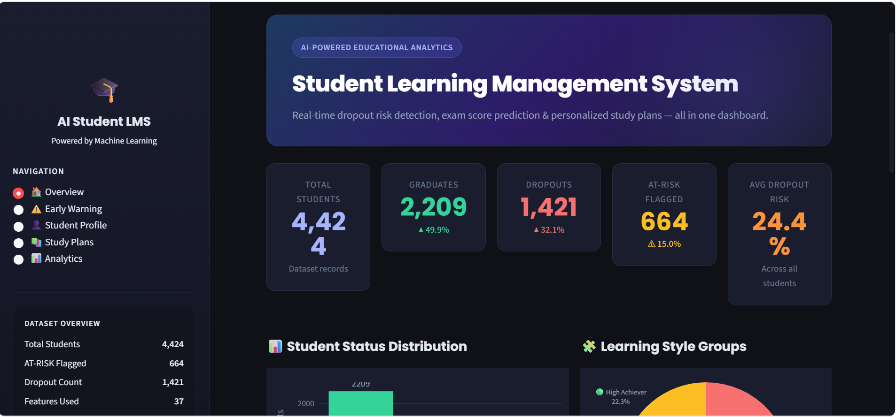

# 🎓 AI-Powered Student Learning Management System

A machine learning system that detects struggling students early, 
predicts dropout risk, and generates personalized study plans.

## 📊 Results
- 🔴 Dropout Detection Rate: **59.2%** (Isolation Forest)
- 🎯 Classifier Accuracy: **77.06%** (Random Forest)
- 👥 Students Analyzed: **4,424**
- ⚠️ At-Risk Flagged: **664 students (15%)**

## 🚀 Features
- **Early Warning System** — Isolation Forest anomaly detection
- **Dropout Classifier** — Random Forest + XGBoost (77% accuracy)
- **Score Predictor** — XGBoost Regressor
- **Learning Style Clustering** — K-Means (4 groups)
- **Streamlit Dashboard** — Interactive teacher interface

## 🛠️ Tech Stack
`Python` `Scikit-learn` `XGBoost` `Pandas` `Streamlit` `Plotly` `Joblib` `Git`
## 📸 Dashboard Screenshots

## 📸 Dashboard Screenshots

### 🏠 Overview


### ⚠️ Early Warning System


### 👤 Student Profile Analysis


### 📚 Personalized Study Plan


### 📊 Academic Analytics Dashboard


## 📁 Project Structure

```
AI_Student_LMS/
├── notebooks/
│   ├── 01_data_understanding.ipynb
│   ├── 02_preprocessing.ipynb
│   ├── 03_anomaly_detection.ipynb
│   └── 04_dropout_classifier.ipynb
├── models/
│   ├── isolation_forest.pkl
│   ├── random_forest.pkl
│   └── xgboost.pkl
├── data/
│   ├── raw/data.csv
│   └── processed/
├── assets/
├── dashboard.py
├── requirements.txt
└── README.md
```
## ▶️ Run Dashboard
```bash
pip install -r requirements.txt
streamlit run dashboard.py
```

## 📌 Dataset
UCI Machine Learning Repository — 
Student Dropout and Academic Success Dataset
4,424 students | 37 features | 3 outcome classes
